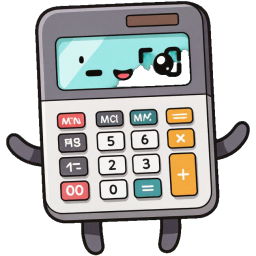

 Inglês (EUA)

# Advanced Omi Calculator
### Here, we'll calculate the square of Aiz, percentages, multiplication tables, unit conversions, and a Fibonacci challenge.

 Português (Brasil)

#  Calculadora Omi Avançada
### Aqui vamos calcular aiz quadrada, porcentagem, tabuada, converao de medida e um desafio de fibonacci.

===================================

## 💻 Tecnologia Usadas
    - HTML
    - CSS
    - JS
    - GIT/GitHub 